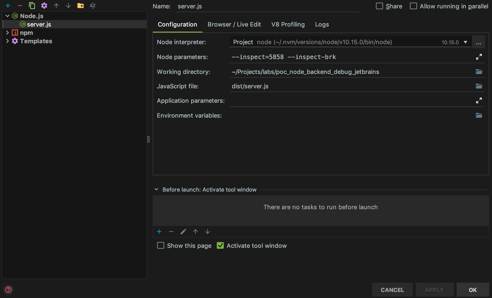
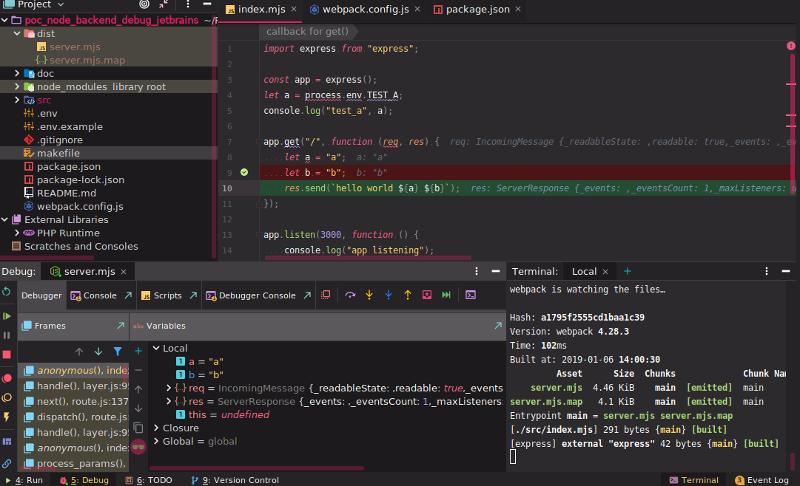

## Quick start
``` BASH
cp .env.example .env
make install
make start-prod
```
go: http://localhost:3000/


## Debug
### config ide


### builder watch
``` BASH
cp .env.example .env
make install
make dev
```

### Debug
